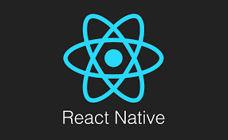
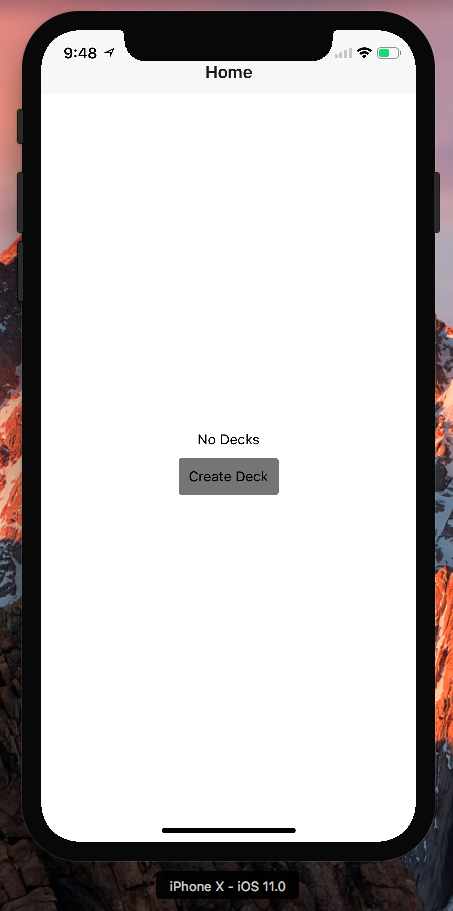

# Udacity
### React Nanodegree Program
##### Project Three - UdaciCards

-----

This is an application created with React Native. This projects demonstrates the understanding of the
tools in React Native's library and how to create applications for iOS and Android.

Here is how you can load the application onto your local machine:

* First, install node.js if you do not have it yet. It comes with npm(node package manage).
Make sure that you install node with the PATH variable so you can run node anywhere in your command prompt/terminal.
* Once node.js is installed, install the react-native package using this command: npm install -g create-react-native-app
* The environment is now ready. After installing the react-native package, you can either clone this repo or download it as a zip. if you download this as a zip, you will have to extract the files.
* you will also need a real device or have an iOS/Android Simulator installed (If using a real device, download the required expo app).
* in your command prompt/terminal, change directory to the server root(where you cloned/extracted the repo) and run: npm install -> then run: npm start
* if using a real device, open the expo app and scan the QR code. If not, use a Simulator
* Wait for build to finish
* Enjoy the app!

# Ryan M. Waite
### Web/Mobile Developer & Programmer
